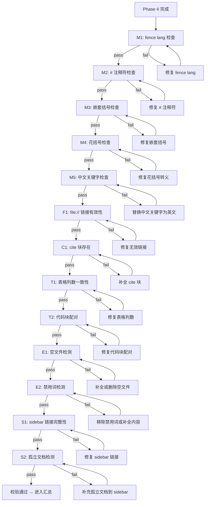

# RepoWiki Generator

生成两层结构的知识库：**Tier 1** 知识卡片（速览）+ **Tier 2** 深度主题文档（详细分析+图表）。

## 版本与更新自检（每次使用前先做，第 0 步）

开始干活前先比对远端最新版，避免用旧版。`<SKILL_DIR>` = 本 skill 的 Base directory（harness 在加载时会告诉你）。

```bash
LOCAL=$(cat "<SKILL_DIR>/VERSION" 2>/dev/null || echo "0.0.0")
REMOTE=$(curl -fsSL https://raw.githubusercontent.com/hwlv/repwiki/main/skills/repowiki-generator/VERSION 2>/dev/null | tr -d '[:space:]')
```

- 拿不到 `REMOTE`（离线 / GitHub 限流）→ 跳过检查，正常继续。
- `REMOTE` 与 `LOCAL` 相等 → 静默继续。
- `REMOTE` 比 `LOCAL` 新（按 semver 比较）→ **必须明确提示用户**，例如：
  > ⚠️ repowiki-generator 本地 v`$LOCAL` 落后，最新 v`$REMOTE`。建议先更新再用：
  > `npx skills update -g`（更新全部已装 skill）；只更这个用 `npx skills add hwlv/repwiki --skill repowiki-generator -g`。

  征得同意后可代为执行更新；**更新后请让用户重新调用本 skill**（当前对话里已加载的还是旧版正文）。用户坚持用旧版可继续，但要说明可能缺新功能/修复。

## Phase 0: 初始化

### 输出目录

1. 用户 `--output <path>` 指定路径 → 直接使用
2. 否则检测调用 agent：`.trae/` → `.trae/repowiki/`，`.codex/` → `.codex/repowiki/`，`.reasonix/` → `.reasonix/repowiki/`
3. 无法判断 → `.repowiki/`

存入 `$OUTPUT_ROOT`。若已存在，优先覆盖生成文件，保留手动编辑文件（标记 `skipped_manual_edit`）。

### 输出结构

```
$OUTPUT_ROOT/
├── .audit/                           # 审计文件（自检用）
│   ├── file_manifest.json
│   ├── unread_files.json
│   ├── entry_clusters.json
│   └── audit_report.json
├── knowledge/{lang}/                 # Tier 1 知识卡片
│   ├── _index.yaml
│   └── {ModuleName}/
│       ├── _module.yaml
│       ├── 概述.md / 项目入口.md / 模块索引.md / ...  (根据 2.4a 探测规则动态生成)
│       └── 关键配置.md                 # optional（有非标准配置时生成）
├── {lang}/content/{Topic}/           # Tier 2 深度主题
│   ├── {Topic}.md
│   ├── {SubTopic}.md                  # optional
│   └── {SubTopicGroup}/               # Level-3 nesting
└── {lang}/meta/repowiki-metadata.json
```

zh/en 目录和文件名按检测语言选择，代码标识符保持原名。

---

## Phase 1: 项目探索

### 1.1 基本信息

确定项目根目录（用户参数 > 当前 workspace）。检测语言：README/注释/配置含中文 → `zh`，否则 `en`。

项目类型检测：

| 文件 | 类型 |
|---|---|
| `package.json` | Node.js/Frontend |
| `pom.xml` / `build.gradle` | Java |
| `Cargo.toml` | Rust |
| `go.mod` | Go |
| `requirements.txt` / `pyproject.toml` | Python |
| `CMakeLists.txt` | C/C++ |
| `*.sln` / `*.csproj` | .NET |

### 1.2 Ignore 规则

读取 `.gitignore` + `.wikiignore`，合并为统一过滤规则。常见模式：`node_modules/`、`dist/`、`build/`、`target/`、`*.log`、`.env*`。

---

## Phase 2: Tier 1 — 模块发现与知识卡片

### 2.1 模块划分

- Monorepo：每个 `packages/*` 或 `apps/*` 为模块
- Maven 多模块：每个 `<module>` 为模块
- 单项目：以根目录为唯一模块，`module_path = ""`
- 多目录启发性：`server/`、`client/`、`shared/` 等各自为模块

模块目录命名：zh 用 `{中文显示名}（{artifactId}）`，en 用 `{DisplayName} ({artifactId})`。显示名来源：pom `<name>` > package.json `description` > README title > artifactId 翻译。

### 2.2 文件清单（强制执行）

对每个模块生成 `$OUTPUT_ROOT/.audit/{module_path}/file_manifest.json`：

```json
{
  "module": "{module_path}",
  "source_files": [{"path": "...", "size_bytes": 0, "language": "rust|typescript|java|..."}],
  "config_files": [{"path": "...", "size_bytes": 0}],
  "test_files": [{"path": "...", "size_bytes": 0}],
  "doc_files": [{"path": "...", "size_bytes": 0}],
  "binary_skipped": [{"path": "...", "reason": "binary|too_large|lock_file|generated"}]
}
```

规则：
- `source_files` 按 size_bytes **降序**排列
- 排除：二进制文件（`.exe`/`.dll`/`.png`/`.pdf` 等）、lock 文件、>500KB 文件
- `language` 标准化名称：`.rs`→`rust`，`.ts/.tsx`→`typescript`，`.java`→`java`，`.go`→`go`，`.py`→`python`，`.cs`→`csharp`，`.kt`→`kotlin`，`.swift`→`swift`，`.proto`→`protobuf`，`.sql`→`sql`，`.yaml`→`yaml`，`.json`→`json`，`.toml`→`toml`
- `.xml`/`.html`/`.md` 归入 config/doc files

### 2.3 读取覆盖率底线（机械门控）

每语言桶必须达标：

| 指标 | 阈值 |
|---|---|
| 字节覆盖率 | ≥ 70% |
| 文件数覆盖率 | ≥ 80% |
| Top 5 按字节文件 | 100% |
| ≥ 150 行文件 | 100%（除非有合法 reason） |

未达标 → 禁止进入 Phase 3。未读文件落盘到 `.audit/{module_path}/unread_files.json` 附 reason。合法 reason：`generated`、`duplicate_of:<path>`、`vendored`、`fixture`、`mechanical_boilerplate`。

### 2.4 生成知识卡片

知识卡片的文件集合**从项目实际内容动态生成**，不再使用预定义固定列表。

#### 2.4a 卡片探测规则

按优先级从高到低扫描项目文件，匹配到的即生成对应卡片：

| 卡片名 | 探测条件 | 内容来源 |
|--------|----------|----------|
| **概述.md** | 必选（单项目） | 从 package.json `description` / Cargo.toml `description` / README 首段提取 |
| **项目入口.md** | 入口文件存在 | 提取 `main.rs` / `main.tsx` / `index.tsx` 等入口文件的结构概览（启动流程、路由注册、Tauri builder setup） |
| **模块索引.md** | 代码目录 ≥3 个顶层目录 | 列出模块目录树 + 各目录职责一句话 |
| **外部依赖.md** | 有 FFI/子进程/外部工具调用 | 从 `entry_clusters.json` 提取 `external_calls` 字段汇总 |
| **代码约定.md** | 存在 `AGENTS.md` / `.trae/rules/` / `CLAUDE.md` / `CONTRIBUTING.md` | 链接到已有规范文件，不重复内容；若无规范文件则生成 2-3 条从代码中观察到的显著约定 |
| **关键配置.md** | 存在非标准配置文件（≥3 个环境变量文件 / build script / CI 配置） | 列出关键配置文件路径 + 用途一句 |

> 不再生成：**技术栈.md**（信息已体现在外部依赖.md 和概述.md 中）、**架构设计.md**（提升为 Tier 2 系统架构主题）、**编码规范.md**（替换为代码约定.md，引用已有规范文件）。

#### 2.4b 生成规则

- 每个卡片为独立 `.md` 文件，不超过 20 行
- 内容为精炼提取，不重复 Tier 2 深度主题中已有的信息
- 所有文件路径使用 `file://` 相对路径格式
- 卡片顺序：概述.md → 项目入口.md → 模块索引.md → 外部依赖.md → 代码约定.md → 关键配置.md
- 在 `_module.yaml` 中更新 `source_files` 字段，列出该模块所有卡片引用的源文件

#### 2.4c 输出结构更新

```
knowledge/{lang}/{ModuleName}/
├── _module.yaml
├── 概述.md          # 必选
├── 项目入口.md       # 条件
├── 模块索引.md       # 条件
├── 外部依赖.md       # 条件
├── 代码约定.md       # 条件
└── 关键配置.md       # 条件
```

---

## Phase 3: Tier 2 — 深度主题生成

### 3.1 主题发现

#### 3.1a 入口反推（强制执行，权威来源）
```json
[{
  "cluster": "pdf-compress",
  "entries": ["pdf_compress", "pdf_compress_in_place"],
  "implementation_files": ["services/pdf_compressor.rs", "commands.rs#L1449-L1668"],
  "total_loc": 720,
  "external_calls": ["x2t.exe", "lopdf"],
  "source": "regex_cluster|file_size_trigger"
}]
```

先扫描业务入口注册表，按名称前缀/模块路径聚类，落盘 `entry_clusters.json`。通用主题表（3.1c）只能作为补充。

| 项目类型 | 入口来源 | 解析方式 |
|---|---|---|
| Tauri/Electron | `#[tauri::command]` / `ipcMain.handle` | grep 命令/处理器注册 |
| Spring Boot/Java Web | `@RestController`/`@RequestMapping`/`@GetMapping` | grep 注解 |
| Express/Fastify/Koa | `router.{get,post,put,delete}` | grep 路由注册 |
| FastAPI/Flask | `@app.route`/`@router.*` | grep 装饰器 |
| gRPC | `.proto` `service` | 解析 proto |
| CLI | `clap`/`cobra`/`argparse` 子命令 | 解析注册 |
| 前端服务层 | `export class` ≥5 public 方法 / `window.api.*` 桥接对象 | grep 导出类 |
| 前端状态管理 | Zustand `create()` / Pinia `defineStore()` / Redux `createSlice()` | grep store 定义 |

> Tauri/Electron 项目必须同时扫描后端命令和前端服务层两套入口。

聚类规则：提取前缀（`pdf_convert_docx_to_pdf` → `pdf`），同前缀 ≥2 个入口 → 同一 cluster。孤立入口按模块路径聚类。Cluster 数 ≤ 入口数 30% 且 ≤12。每个 cluster ≥2 入口。命名用英文小写+连字符，反映业务功能。

#### 3.1b 集群分类（供文档生成参考）

`entry_clusters.json` 中的每个 cluster 都会在 3.3 中自动生成独立深度文档。以下触发器用于**标记大型/复杂 cluster**（需额外关注图表数量和细节深度）：

- 入口 ≥3 且实现 LOC ≥200 → 标记为"复杂 cluster"，图表数应 ≥4
- 涉及 ≥2 进程边界（FFI/子进程/外部资源/网络）→ 需额外 `sequenceDiagram` 展示跨进程交互
- 调用外部二进制/动态库（`.exe`/`.dll`/`.so`）→ 需说明外部依赖和调用方式

> 无论 cluster 体积大小，每个 cluster 都必须生成独立文档（见 3.3），不得合并或省略。

#### 3.1c 通用主题表（补充）

| 主题 | 条件 | | 主题 | 条件 |
|---|---|---|---|---|
| 项目概述 | 必选 | | 测试策略 | 有测试 |
| 快速开始 | 必选 | | 安全与权限 | 有认证/鉴权 |
| 系统架构 | 必选 | | 配置与环境变量 | ≥3 配置文件 |
| 核心功能模块 | 有 entry_clusters（每个 cluster 生成独立文档） | | 构建与部署 | 构建非平凡 |
| API与集成 | 暴露 API/集成外部 | | 故障排除 | 必选 |
| 数据管理 | 有数据模型/DB | | 开发者指南 | 必选 |

### 3.2 生成主题文档

**文件路径**: `{lang}/content/{TopicName}/{TopicName}.md`

**结构**：`# {Topic}` → `<cite>` 块（列出所有引用源文件，`file://` 短路径）→ `## 目录` → 各章节

**内容规则**：段落 ≤4 句。优先表格/列表/标签。`file://` 用最短无歧义路径。

> **`file://` 路径格式统一规范**：全部使用 `file://` 后接**相对项目根目录**的路径，格式为 `[显示名](file://相对路径)`。
> 正确示例：`[commands.rs](file://src-tauri/src/commands.rs)`、`[lbtb_zip.rs](file://src-tauri/src/services/lbtb_zip.rs)`
> 错误格式：`file:///`（三斜杠绝对路径）、`file:src/...`（单冒号无斜杠）
> 路径必须相对于项目根目录，不以 `/` 开头。

| 章节 | 要求 |
|---|---|
| 引言 | 1-2 段，含受众、范围、主题枚举 |
| 项目结构 | ≤5 项用列表，≥5 项用表格 + Mermaid `graph TB` |
| 核心组件 | 表格：组件 / 职责 / 对外接口 / 协作者 |
| 架构总览 | 2-3 段 + Mermaid |
| 详细组件分析 | 每组件 ≤4 句 + 可选关键方法列表 |

**写作规范**：客观第三人称。术语首次使用时定义。量化声明（避免"快""多"）。统一术语。禁止 "TODO"/"待补充"/"略"。

#### 3.2a 图表产出指引

每个 Tier 2 主题默认产出至少 2-4 张 Mermaid 图表（具体数量见下表），节点使用代码库中的真实类名/函数名。产出 <50% 期望需在 `diagram_skipped_reasons` 说明原因。

| 主题 | 期望图数 | 推荐图类型 |
|---|---|---|
| 项目概述 | 3 | `graph TB` + `flowchart LR` + `sequenceDiagram` |
| 快速开始 | 3 | `graph TB` + `sequenceDiagram` ×2 |
| 系统架构 | 4 | `graph TB` + `sequenceDiagram` ×2 + `flowchart LR` |
| 核心功能模块（每 cluster） | 3 | `graph TB` + `sequenceDiagram` + `flowchart TD` |
| API与集成 | 4 | `sequenceDiagram` ×2 + `flowchart TD` + `classDiagram` |
| 数据管理 | 4 | `graph TB` + `classDiagram` + `sequenceDiagram` + `flowchart TD` |
| 构建与部署 | 3 | `flowchart LR` ×2 + `sequenceDiagram` |
| 测试策略 | 3 | `sequenceDiagram` + `flowchart TD` + `classDiagram` |
| 安全与权限 | 4 | `sequenceDiagram` ×2 + `flowchart TD` + `classDiagram` |
| 故障排除 | 2 | `flowchart TD` ×2 |

**FENCE LANG 铁律（#1 图表不显示原因）**：

```
正确：                        错误（图表不显示）：
```mermaid                    ```sequenceDiagram
graph TB                        participant A
    A --> B                     A->>B: ...
```                             ```
```

- **fence language 永远是 `mermaid`**，图类型写在代码块内部第一行
- 禁止把图类型当 fence lang：` ```sequenceDiagram` / ` ```flowchart LR` / ` ```graph TB` 等均为错误格式
- `index.html` 的 `lang === 'mermaid'` 只识别这一个值
- 生成完成后运行 `grep -rn '^```\(sequenceDiagram\|flowchart\|graph\|classDiagram\|stateDiagram\)' .wiki/` 自检

**其他规则**：真实类名/函数名作节点（禁止占位符）。用 `subgraph` 分组。边缘标注交互说明。用 `&lt;br/&gt;` 多行标签。花括号 `{` `}` 转义为 `&#123;` `&#125;`。

**Mermaid 内容语法铁律（#2 图表不显示原因）**：

以下字符/模式在 Mermaid 代码块中会导致渲染失败，**生成时必须避免**：

| 问题模式 | 说明 | 错误示例 | 正确做法 |
|----------|------|----------|----------|
| `[` 或 `]` 出现在未加引号的 `[...]` 节点标签中 | Mermaid 将嵌套 `[...]` 误解析为形状语法 | `A[Rust #[tauri::command]]` | `A["Rust tauri::command"]` |
| `#` 字符在节点标签中 | Mermaid 将 `#` 解释为注释起始符，导致行剩余部分被忽略 | `B[foo #bar]` → 只看到 `B[foo`，后续语法断裂 | 移除 `#` 或用引号包裹：`B["foo bar"]` |
| 节点标签中包含未转义的花括号 `{` `}` | Mermaid 将 `{` `}` 解释为集合语法 | `C[{key: value}]` | `C["&#123;key: value&#125;"]` |
| `(` `)` 在 `graph`/`flowchart` 图的节点标签中未加引号 | 与圆角矩形形状语法冲突 | `D[foo(bar)]` | `D["foo(bar)"]` 或 `D(foo bar)` |
| 节点标签中包含 `:` 且不在引号内（部分 Mermaid 版本） | 可能被解析为键值对分隔符 | `E[tag: value]` | `E["tag: value"]` |
| `参与者` / `参与` / `注意` / `循环` 等中文关键字取代英文关键字 | Mermaid 仅识别英文关键字（`participant`/`Note over`/`loop` 等），中文关键字会被当作文本忽略 | `参与者 X as Y` / `注意 over A,B: 内容` | 使用英文关键字：`participant X as Y` / `Note over A,B: text` |

**通用安全规则**：所有节点标签中若包含 `[`, `]`, `{`, `}`, `(`, `)`, `#`, `:` 等特殊字符，应使用双引号包裹：`NodeID["标签文本"]`。**所有 Mermaid 关键字（`participant`、`Note over`、`loop`、`alt`、`opt`、`par`、`rect`、`activate`、`deactivate`、`destroy` 等）必须使用英文，禁止使用中文翻译。**

**生成后自检命令**：
```
# 检查 mermaid 块内是否有未引号包裹的方括号嵌套
grep -rn '\[.*\[.*\]' $OUTPUT_ROOT/zh/content/ --include='*.md' -A0 -B0

# 检查 mermaid 块中是否有 # 出现在节点标签内
grep -rn '#[a-z]' $OUTPUT_ROOT/zh/content/ --include='*.md'

# 检查 mermaid 块中是否有中文关键字取代英文关键字
grep -rn '参与者\b\|^   参与\b\|^   注意\b\|^   循环\b' $OUTPUT_ROOT/ --include='*.md'
```

### 3.3 核心功能模块生成规则 —— 每个 cluster 独立文档

**核心理念**：不再生成聚合页 `核心功能模块/核心功能模块.md`。`entry_clusters.json` 中的**每一个 cluster 都自动升级为一个独立的深度文档**，生成在 `{lang}/content/核心功能模块/{Cluster中文名}.md`。

#### 3.3a 文件路径与命名

- 目录：`{lang}/content/核心功能模块/`
- 每个 cluster 一个文件：`{Cluster中文名}.md`（中文名由 cluster 设计意图决定，可从 entry 名称和实现文件路径推导）
- 不再生成汇总页 `核心功能模块.md`

#### 3.3b 每个 cluster 文档必须包含

每份 cluster 文档均需以下全部内容，缺一不可：

| 内容项 | 要求 |
|--------|------|
| `<cite>` 块 | 列出该 cluster 的 `implementation_files` 中所有源文件（`file://` 格式） |
| 功能概述 | 2-4 句，描述该 cluster 的业务目的、覆盖的命令/函数、在系统中的作用 |
| `sequenceDiagram` | 至少 1 张，使用真实的命令/函数名，展示关键调用流 |
| `flowchart TD` 或 `graph TB` | 至少 1 张，≥5 个节点，标注源文件出处 |
| 命令/API 清单表 | 表格列出所有入口（entry），格式：命令名 / 所属文件 / 功能 / 输入 / 输出 |
| 输入输出契约表 | 每个命令的入参、返回值、副作用 |
| 失败模式表 | ≥3 个场景，含原因和处理方式 |
| 代码位置索引 | `文件#L起始-结束` 格式，指向关键函数位置 |

#### 3.3c 文档长度与质量要求

- 建议 80-300 行，最少 60 行
- 每个 cluster 文档必须是完整、自包含的深度分析
- 禁止将多个 cluster 合并到一个文档中
- 禁止遗漏 `entry_clusters.json` 中的任何 cluster

#### 3.3d 输出结构

```
{lang}/content/核心功能模块/
├── 工作区管理.md          （cluster: workspace-management）
├── DOCX渲染引擎.md         （cluster: docx-render）
├── PDF操作.md              （cluster: pdf-operations）
├── 对话框文件操作.md        （cluster: dialog-file-operations）
├── 认证与安全.md            （cluster: auth-security）
├── 数据库.md               （cluster: database）
├── 最近文件.md             （cluster: recent-files）
├── 投标生成.md             （cluster: bid-generation）
├── 答疑澄清.md             （cluster: clarification）
├── 素材复用.md             （cluster: material-reuse）
├── 数据字典.md             （cluster: dict-data）
├── 文件IO.md               （cluster: file-io）
├── CTB操作.md              （cluster: ctb-operations）
├── 硬件信息.md             （cluster: hardware）
└── 更新与Dongle.md         （cluster: update-dongle）
```

> 上面的文件清单仅为示例，实际生成时根据 `entry_clusters.json` 内容动态确定。文件名使用 cluster 对应的中文名。

#### 3.3e 自检规则

- 生成后 grep `entry_clusters.json` 中所有 `"cluster"` 值，逐一确认 `核心功能模块/` 目录下有对应的 `.md` 文件
- 覆盖率必须 = 1.00（即每个 cluster 都有独立文档，不得遗漏任何一个）
- 每个 cluster 文档的引用完整性：`implementation_files` 中所有文件路径必须在文档中以 `file://` 链接形式出现

### 3.4 生成元数据

生成 `{lang}/meta/repowiki-metadata.json`，含 `knowledge_relations`（PARENT_CHILD 关系，UUID v5 稳定 ID）、`recovery_checkpoint`、`last_commit_id`。时间戳遵循确定性输出原则。

---

## Phase 3.5: 覆盖率自审计（强制门控）

生成 `$OUTPUT_ROOT/.audit/audit_report.json`：

```json
{
  "phase": "3.5_self_audit",
  "checks": [
    {"name": "byte_coverage_<lang>", "actual": 0.83, "threshold": 0.70, "status": "pass"},
    {"name": "file_count_coverage_<lang>", "actual": 0.88, "threshold": 0.80, "status": "pass"},
    {"name": "top5_files_<lang>", "actual": 1.00, "threshold": 1.00, "status": "pass"},
    {"name": "large_file_150loc", "actual": 0.95, "threshold": 1.00, "status": "pass"},
    {"name": "entry_cluster_coverage", "actual": 1.00, "threshold": 1.00, "status": "pass"},
    {"name": "cluster_doc_coverage", "actual": 1.00, "threshold": 1.00, "status": "pass"},
    {"name": "large_file_cite_coverage", "actual": 0.90, "threshold": 1.00, "status": "pass"},
    {"name": "mermaid_fence_lang", "actual": 1.00, "threshold": 1.00, "status": "pass"},
    {"name": "mermaid_content_valid", "actual": 1.00, "threshold": 1.00, "status": "pass"}
  ],
  "diagram_skipped_reasons": {},
  "blocking_failures": []
}
```

**`blocking_failures` 非空 → 禁止进入 Phase 4。**

**`cluster_doc_coverage` 检查逻辑**：`entry_clusters.json` 中每个 cluster 必须在 `{lang}/content/核心功能模块/` 目录下有对应的独立 `.md` 文档。覆盖率 = 存在文档的 cluster 数 / cluster 总数。阈值 1.00（即不得遗漏任何一个 cluster）。

**`mermaid_content_valid` 检查逻辑**：扫描所有 `*.md` 文件中的 Mermaid 代码块（```` ```mermaid ```` 至 ```` ``` ```` 之间的内容），执行以下检查：
1. 节点标签中是否包含 `#` 字符（Mermaid 注释符）—— 出现即违规
2. 节点标签 `[...]` 中是否包含未加引号的 `[` 或 `]`（嵌套形状语法冲突）
3. `(. .)` 圆括号是否出现在 graph/flowchart 图的未加引号 `[...]` 节点标签中

三项检查全部通过 → `actual = 1.00`，任一失败 → `actual < 1.00` 并记录到 `blocking_failures`。

---

## Phase 4: 查看器生成

生成 Docsify 兼容文件（除非 `--no-viewer`）：

**`README.md`**: 项目名 + 按类别分组的主题链接（只包含实际存在的主题）。

**`index.html`**: 完整模板含 docsify + mermaid@10 CDN，`lang === 'mermaid'` 渲染器，搜索插件。

**`_sidebar.md`**: 按入门/模块知识卡片/深度主题分组，核心功能模块下每个 cluster 独立文档作为平级条目列出。

完成后提示：`npx docsify serve {OUTPUT_ROOT}`

---

## 红线（违规即重做）

- **Mermaid fence lang 用了 `sequenceDiagram`/`flowchart`/`graph` 等图类型名（应为 `mermaid`）**
- **Mermaid 节点标签中使用了 `#` 字符（Mermaid 注释符会使行剩余部分被忽略）**
- **Mermaid 节点标签 `[...]` 中嵌套了未加引号的 `[` 或 `]`（如 `Node[foo[bar]]` 应为 `Node["foo[bar]"]`）**
- **Mermaid graph/flowchart 图中节点标签 `[...]` 内含 `(` `)` 圆括号且未加引号**
- **Mermaid 中文关键字（`参与者`/`参与`/`注意`/`循环` 等）取代英文关键字（`participant`/`Note over`/`loop` 等）**
- 未生成 `file_manifest.json`
- 任一语言桶覆盖率不达标
- ≥150 LOC 文件未读且无合法 reason
- 未生成 `entry_clusters.json` 就用通用主题表
- 业务 cluster 被压缩成一段而非独立主题
- **entry_clusters 中某个 cluster 未生成独立文档（`cluster_doc_coverage` < 1.00）**
- **将多个 cluster 合并到一个文档中（每个 cluster 必须独立成文档）**
- 未生成 `audit_report.json` 或有 blocking_failures
- ≥10KB 源文件已读但未出现在任何 Tier 2 `<cite>` 中

---

## 执行算法

1. 解析 `$OUTPUT_ROOT`，检查已有输出
2. 读取根配置、README、ignore 文件
3. 发现模块，生成 `file_manifest.json`
4. 按覆盖率底线读取源文件
5. 生成 Tier 1（`_index.yaml`、`_module.yaml`、知识卡片）
6. 入口反推 → `entry_clusters.json` → cluster 升级决策
7. 生成 Tier 2（通用主题 + 每个 cluster 独立深度文档，图表使用 `mermaid` fence lang）
8. 生成 `audit_report.json`，blocking_failures 非空→回退重做
9. 生成 `repowiki-metadata.json`
10. 生成 viewer（README + index.html + _sidebar.md）
11. 运行 **Phase 4.5 文档格式校验**（所有门控通过后方可继续）
12. 输出汇总报告

---

## Phase 4.5: 文档格式校验（强制门控）

**在生成 viewer 之后立即执行，所有校验项必须通过。任一失败 → 修复后重新校验。**

### 4.5a 校验清单

以下每个校验项均需在生成的所有 `*.md` 文件上执行，结果聚合到 `$OUTPUT_ROOT/.audit/format_validation.json`。

| # | 校验项 | 说明 | 检测命令/方法 | 阈值 |
|---|--------|------|--------------|------|
| M1 | Mermaid fence lang | ` ``` ` 之后第一行不是 `graph`/`flowchart`/`sequenceDiagram`/`classDiagram`/`stateDiagram` | `grep -rn '^```\(sequenceDiagram\|flowchart\|graph\|classDiagram\|stateDiagram\)' $OUTPUT_ROOT/` | 零命中 |
| M2 | Mermaid `#` 注释符 | 节点标签中 `[...]` 或 `(...)` 或字符串内包含 `#` | grep mermaid 块内容中 `^[^%]*[A-Za-z0-9_]+\[[^\]]*#[^\]]*\]` 模式 | 零命中 |
| M3 | Mermaid 嵌套括号 | `...[` 或 `]...` 或 `(...(` 或 `)...)` 出现在标签中 | grep mermaid 块内容中 `\[[^\]]*\[` 或 `\][^\[]*\]` | 零命中 |
| M4 | Mermaid 花括号 | 节点标签中 `{` `}` 出现且未转义为 `&#123;` `&#125;` | grep mermaid 块中 `\[[^\]]*\{` （排除含 `&#123;` 的行） | 零命中 |
| M5 | Mermaid 中文关键字 | mermaid 块中使用了中文关键字（`参与者`/`参与`/`注意`/`循环`等）取代英文关键字 | grep mermaid 块内容中 `参与者` 或 `^   参与\b` 或 `^   注意\b` 或 `^   循环\b` | 零命中 |
| F1 | file:// 链接有效性 | 所有 `[xxx](file://RELATIVE_PATH)` 中的路径真实存在 | 提取所有 `file://` 链接，用 `Test-Path` / `test -f` 逐条验证 | 100% |
| F2 | file:// 路径格式 | 路径为相对路径（不以 `/` 开头、不含 `:///` 三斜杠） | grep `file://` 链接格式 `file://[^/]` | 100% 合规 |
| C1 | `<cite>` 块存在 | 所有 Tier 2 主题和核心功能模块独立文档 `*.md` 开头含 `<cite>` 块 | 列出 `content/` 下所有 `*.md`，检查是否含 `> <cite>` 或 `<cite>` 标签 | 100% |
| C2 | cite 引用文件存在 | `<cite>` 中 `file://` 链接指向的文件在项目中存在 | 提取 cite 块内所有 file:// 链接后验证 | 100% |
| T1 | 表格列数一致性 | 同一表格中所有行的 `|` 数量相同 | 提取每个 `|  |  |` 表格段，逐行统计 `|` 数 | 一致 |
| T2 | Markdown 代码块配对 | ` ``` ` 开启和关闭数量匹配 | `grep -c '```'` 对每个 file 统计，确认 `% 2 == 0` | 100% |
| E1 | 空文件检测 | 无内容或内容过少（< 10 行）的 `*.md` 文件 | `wc -l` 或等价方式统计行数 | 零文件 |
| E2 | 禁用词检测 | 文档中不应出现 `TODO`、`待补充`、`略`、`TBD`、`WIP` | `grep -rni 'TODO\|待补充\|TBD\|WIP'` 在 `content/` 下 | 零命中 |
| S1 | 目录条目完整性 | `_sidebar.md` 中列出的每个 `*.md` 链接文件存在 | 提取 `_sidebar.md` 中所有路径，逐一验证 | 100% |
| S2 | 孤立足文档 | `content/` 下有 `*.md` 但未出现在 `_sidebar.md` 中 | 比对文件系统列表和侧边栏引用列表 | 零孤立文件 |

### 4.5b 执行流程



### 4.5c 校验结果输出

生成 `$OUTPUT_ROOT/.audit/format_validation.json`：

```json
{
  "phase": "4.5_format_validation",
  "total_files_scanned": 30,
  "checks": [
    {"id": "M1", "name": "mermaid_fence_lang", "status": "pass", "details": "所有 fence lang 均为 mermaid"},
    {"id": "M2", "name": "mermaid_hash_comment", "status": "pass", "details": "无 # 出现在节点标签中"},
    {"id": "M3", "name": "mermaid_nested_brackets", "status": "pass", "details": "无嵌套括号冲突"},
    {"id": "M4", "name": "mermaid_curly_braces", "status": "pass", "details": "无未转义花括号"},
    {"id": "M5", "name": "mermaid_cn_keyword", "status": "pass", "details": "无中文关键字取代英文关键字"},
    {"id": "F1", "name": "file_link_validity", "status": "pass", "details": "100% 链接有效"},
    {"id": "F2", "name": "file_link_format", "status": "pass", "details": "所有 file:// 路径为相对路径"},
    {"id": "C1", "name": "cite_block_presence", "status": "pass", "details": "所有 Tier 2 文件含 cite 块"},
    {"id": "C2", "name": "cite_file_link_validity", "status": "pass", "details": "cite 块内链接有效"},
    {"id": "T1", "name": "table_column_consistency", "status": "pass", "details": "所有表格列数一致"},
    {"id": "T2", "name": "code_block_pairing", "status": "pass", "details": "所有代码块正确配对"},
    {"id": "E1", "name": "empty_file_check", "status": "pass", "details": "无空文件"},
    {"id": "E2", "name": "forbidden_words", "status": "pass", "details": "无禁用词"},
    {"id": "S1", "name": "sidebar_link_integrity", "status": "pass", "details": "sidebar 链接完整"},
    {"id": "S2", "name": "orphan_docs", "status": "pass", "details": "无孤立文档"}
  ],
  "first_pass_failures": [],
  "final_status": "all_pass"
}
```

**`first_pass_failures` 非空 → 修复后重新校验，直到全部通过。**

---

## 输出验证

- **Mermaid fence lang 自检**：`grep -rn '^```\(sequenceDiagram\|flowchart\|graph\|classDiagram\|stateDiagram\)' $OUTPUT_ROOT/` 无命中
- **Mermaid 内容语法自检**：
  - 扫描所有 `*.md` 中 ` ```mermaid ` 代码块，确认无 `#` 出现在节点标签中
  - 确认所有含 `[`/`]` 的节点标签使用双引号包裹（`Node["..."]` 格式）
  - 确认 `graph`/`flowchart` 图的 `[...]` 标签中不包含 `( )` 圆括号
  - **确认 mermaid 代码块中无中文关键字（`参与者`/`参与`/`注意`/`循环` 等）取代英文关键字**
- 所有 `file://` 短路径正确
- 所有主题出现在 `_sidebar.md`
- **核心功能模块**下每个 cluster 有独立 `.md` 文档（grep `entry_clusters.json` 中所有 `"cluster"` 值，逐一确认在 `核心功能模块/` 目录下有对应文件）
- Mermaid 节点使用真实标识符
- `_index.yaml`/`_module.yaml` 使用 dash-prefixed scope 列表
- 汇总：selected scope、created/updated/unchanged/skipped 文件数
